# NileDefender — Mermaid Diagrams

All diagrams from the full project documentation, ready to use in any Mermaid-compatible renderer.

---

## 1. Architecture Diagram

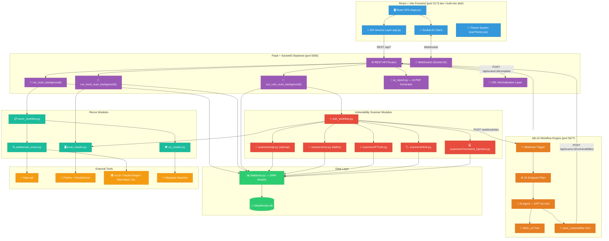

---

## 2. Database ER Diagram

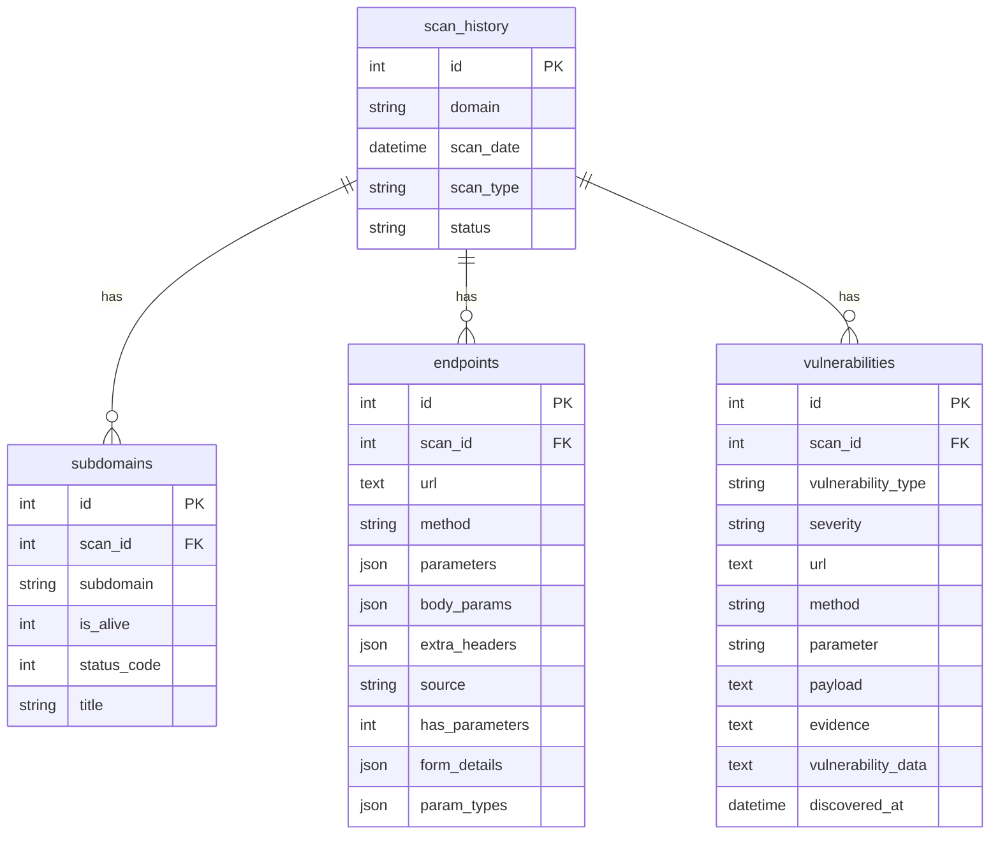

---

## 3. Recon Workflow Phases

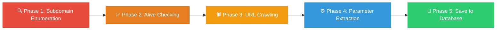

---

## 4. URL Crawling Strategy (Remote)

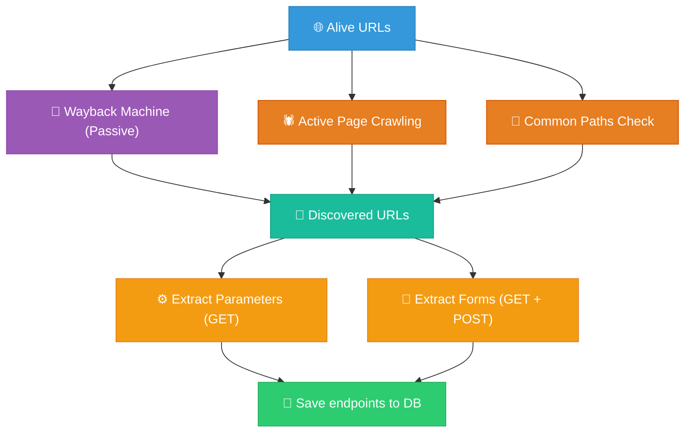

---

## 5. Local Crawler Flow

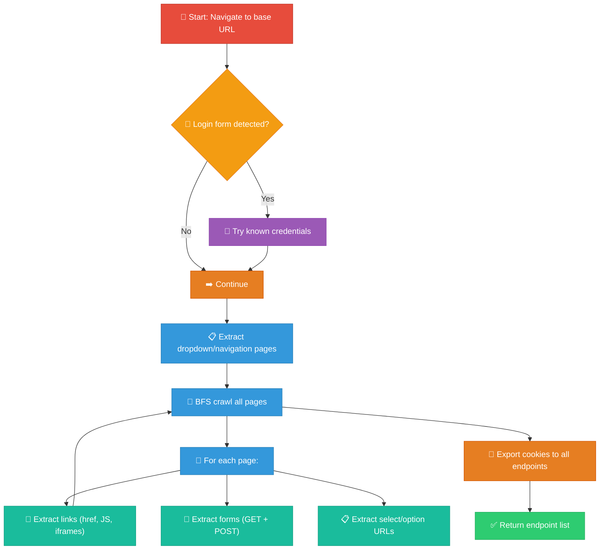

---

## 6. Remote Domain Scan — Sequence Diagram

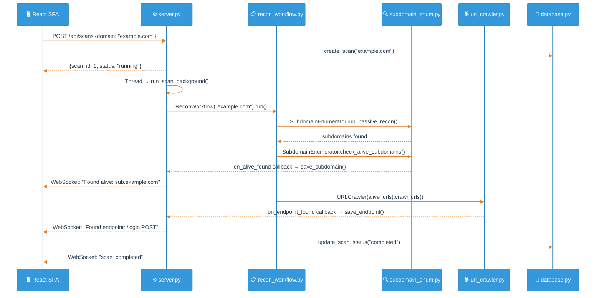

---

## 7. Local Target Scan — Sequence Diagram

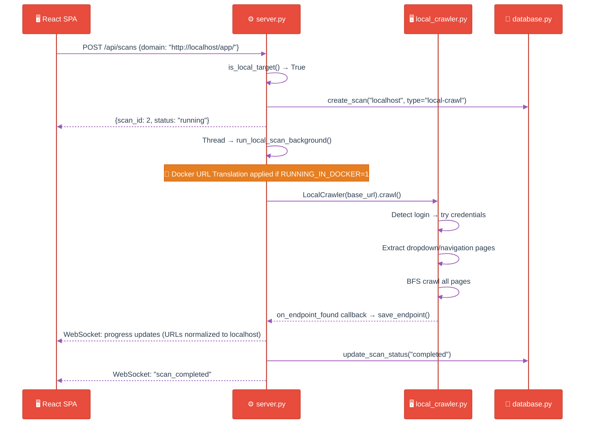

---

## 8. Subdomain Enumeration Strategy (Detailed)

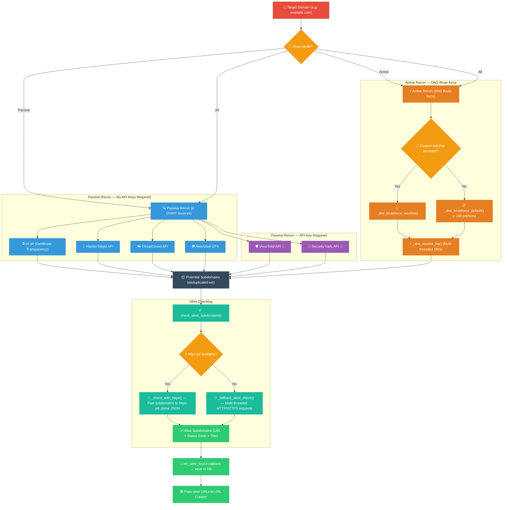

---

## 9. Subdomain Enumeration Strategy (Compact)

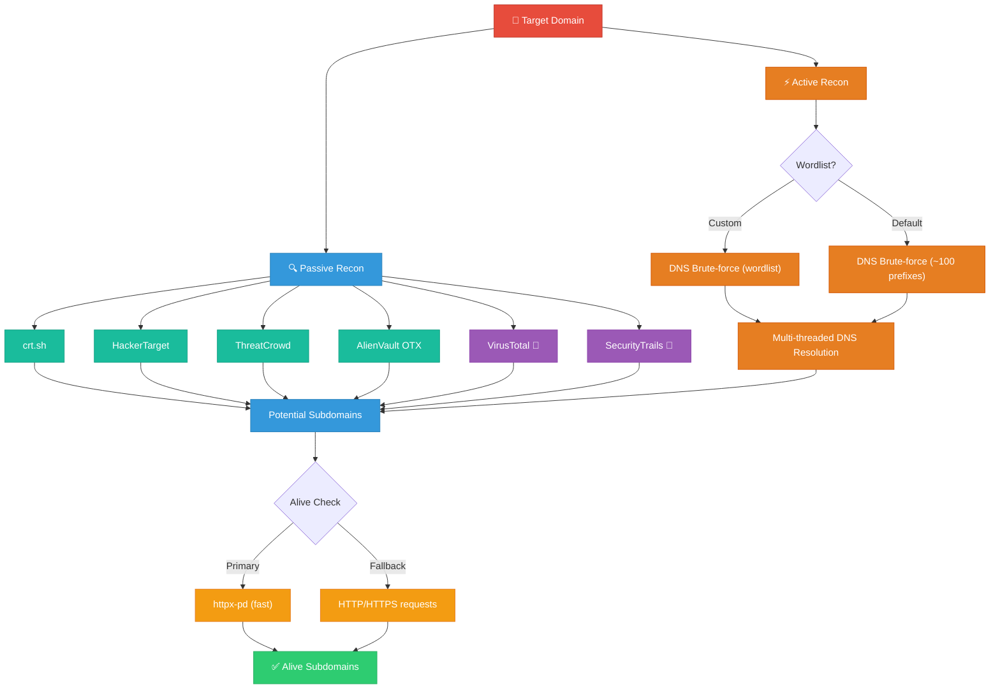

---

## 10. Server.py — Flask API & Background Scans

```mermaid
flowchart TB
    REQ["🌐 Incoming Request"] --> DETECT{"🔀 Target Type?"}
    DETECT -->|"Remote (example.com)"| REMOTE["🧵 Background Thread"]
    DETECT -->|"Local (localhost)"| LOCAL["🧵 Background Thread"]

    subgraph API["REST API Routes"]
        R1["GET /api/scans"]
        R2["POST /api/scans"]
        R3["GET /api/scans/:id"]
        R4["DELETE /api/scans/:id"]
        R5["DELETE /api/scans/all"]
        R6["GET /api/scans/search"]
        R7["GET /api/scans/:id/stats"]
        R8["GET /api/scans/:id/subdomains"]
        R9["GET /api/scans/:id/endpoints"]
        R10["GET /api/scans/:id/vulnerabilities"]
        R11["POST /api/scans/:id/vulnerabilities"]
        R12["POST /api/scans/:id/vulnscan"]
        R13["POST /api/vulnscan/start"]
        R14["POST /api/scans/:id/complete"]
        R15["POST /api/scans/:id/report"]
        R16["GET /api/dashboard/stats"]
        R17["GET /api/all/subdomains"]
        R18["GET /api/all/endpoints"]
        R19["GET /api/all/vulnerabilities"]
    end

    REMOTE --> SE["🔍 subdomain_enum.py"]
    REMOTE --> UC["🕷️ url_crawler.py"]
    LOCAL --> LC["🖥️ local_crawler.py"]

    subgraph VulnScan["Vulnerability Scanning"]
        VW["⚡ vuln_workflow.py"]
        VW --> SQLI["💉 sqli.py (sqlmap)"]
        VW --> XSS["✨ xss.py (dalfox)"]
        VW --> PT["📂 PTVuln.py"]
        VW --> HTMLI["🏷️ htmli.py"]
        VW --> CMDI["💻 Command_Injection.py"]
        VW -->|"POST /webhook/idor"| N8N["🤖 n8n AI Agent"]
    end

    R13 --> DETECT_V{"🔀 Vuln Target"}
    DETECT_V --> VW

    subgraph WS["WebSocket (Socket.IO)"]
        W1["🔌 connect"]
        W2["📡 join_scan"]
        W3["📊 scan_update →"]
        W4["✅ scan_completed →"]
        W5["🛡️ vulnscan_completed →"]
        W6["❌ scan_error →"]
    end

    SE & UC & LC -->|"Callbacks"| DB["💾 Database (SQLite)"]
    SQLI & XSS & PT & HTMLI & CMDI -->|"Save vulns"| DB
    SE & UC & LC -->|"Progress"| W3
    VW -->|"Progress"| W3
    W3 -->|"Real-time"| UI["🖥️ React SPA"]
    API -->|"JSON"| UI
    R2 --> DETECT

    subgraph Docker["🐳 Docker URL Normalization"]
        DT["localhost → host.docker.internal (outgoing)"]
        DR["host.docker.internal → localhost (for DB/UI)"]
    end

    classDef api fill:#3498db,stroke:#2980b9,color:#fff
    classDef ws fill:#9b59b6,stroke:#8e44ad,color:#fff
    classDef module fill:#1abc9c,stroke:#16a085,color:#fff
    classDef db fill:#2ecc71,stroke:#27ae60,color:#fff
    classDef thread fill:#e67e22,stroke:#d35400,color:#fff
    classDef ui fill:#e74c3c,stroke:#c0392b,color:#fff
    classDef req fill:#34495e,stroke:#2c3e50,color:#fff
    classDef vuln fill:#c0392b,stroke:#922b21,color:#fff
    classDef docker fill:#f39c12,stroke:#e67e22,color:#fff
    classDef decision fill:#f39c12,stroke:#e67e22,color:#fff

    class R1,R2,R3,R4,R5,R6,R7,R8,R9,R10,R11,R12,R13,R14,R15,R16,R17,R18,R19 api
    class W1,W2,W3,W4,W5,W6 ws
    class SE,UC,LC module
    class DB db
    class REMOTE,LOCAL thread
    class UI ui
    class REQ req
    class SQLI,XSS,PT,HTMLI,CMDI,N8N vuln
    class DT,DR docker
    class DETECT,DETECT_V decision
```

---

## 11. Database.py — Data Layer Operations

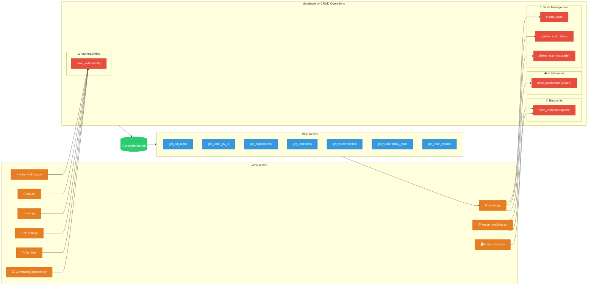

---

## 12. Frontend — React SPA

```mermaid
flowchart TB
    subgraph Pages["📄 SPA Pages (React Router)"]
        P1["🏠 Dashboard"]
        P2["📋 Scans"]
        P3["🔎 ScanDetails"]
        P4["🌐 Subdomains"]
        P5["🔗 Endpoints"]
        P6["🛡️ Vulnerabilities"]
    end

    P1 -->|"View scan"| P3
    P2 -->|"View scan"| P3
    P1 & P2 -->|"New Scan"| MODAL["📝 NewScanModal"]

    subgraph Details["Scan Details Tabs"]
        T1["🌐 Subdomains Tab"]
        T2["🔗 Endpoints Tab"]
        T3["🛡️ Vulnerabilities Tab"]
    end

    P3 --> T1 & T2 & T3
    P3 -->|"Delete"| DEL["🗑️ DeleteModal"]
    P3 -->|"Generate Report"| REPORT["📄 AI PDF Report"]
    P3 -->|"Export"| EXPORT["📥 JSON/CSV Export"]

    subgraph Components["🧩 Shared Components"]
        SIDEBAR["📌 Sidebar.jsx"]
        STAT["📊 StatCard.jsx"]
        BADGE["🏷️ Badge.jsx"]
        THEME_SW["🎨 ThemeSwitcher.jsx"]
        NOTIF["🔔 Notification.jsx"]
    end

    subgraph JS["📡 api.js → API Service Layer"]
        A1["GET /api/dashboard/stats"]
        A2["GET /api/scans"]
        A3["POST /api/scans"]
        A4["GET /api/scans/:id"]
        A5["DELETE /api/scans/:id"]
        A6["POST /api/scans/:id/vulnscan"]
        A7["POST /api/vulnscan/start"]
        A8["POST /api/scans/:id/report"]
        A9["GET /api/all/subdomains"]
        A10["GET /api/all/endpoints"]
        A11["GET /api/all/vulnerabilities"]
    end

    P1 --> A1
    P2 --> A2
    MODAL -->|"Recon"| A3
    MODAL -->|"Vuln (new)"| A7
    MODAL -->|"Vuln (existing)"| A6
    P3 --> A4
    DEL -->|"Confirm"| A5
    REPORT --> A8
    P4 --> A9
    P5 --> A10
    P6 --> A11

    subgraph WSock["🔌 WebSocket (useSocket.js)"]
        W1["🔌 connect"]
        W2["📡 join_scan → subscribe to room"]
        W3["📊 scan_update → live progress"]
        W4["✅ scan_completed → recon done"]
        W5["🛡️ vulnscan_completed → vuln done"]
        W6["❌ scan_error → error handling"]
    end

    A3 -->|"Scan created"| W2
    W3 -->|"Progress messages"| P3
    W4 & W5 -->|"Scan complete"| TOAST["🔔 Notification Toast"]

    classDef page fill:#3498db,stroke:#2980b9,color:#fff
    classDef modal fill:#9b59b6,stroke:#8e44ad,color:#fff
    classDef tab fill:#1abc9c,stroke:#16a085,color:#fff
    classDef api fill:#e67e22,stroke:#d35400,color:#fff
    classDef ws fill:#e74c3c,stroke:#c0392b,color:#fff
    classDef notify fill:#2ecc71,stroke:#27ae60,color:#fff
    classDef comp fill:#f39c12,stroke:#e67e22,color:#fff
    classDef action fill:#c0392b,stroke:#922b21,color:#fff

    class P1,P2,P3,P4,P5,P6 page
    class MODAL,DEL modal
    class T1,T2,T3 tab
    class A1,A2,A3,A4,A5,A6,A7,A8,A9,A10,A11 api
    class W1,W2,W3,W4,W5,W6 ws
    class TOAST notify
    class SIDEBAR,STAT,BADGE,THEME_SW,NOTIF comp
    class REPORT,EXPORT action
```

---

## 13. Vulnerability Scan Flow

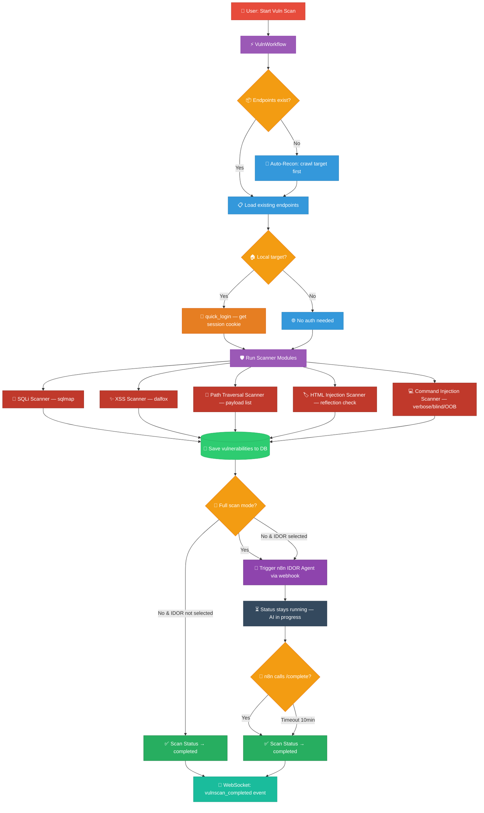

---

## 14. n8n IDOR Agent Flow

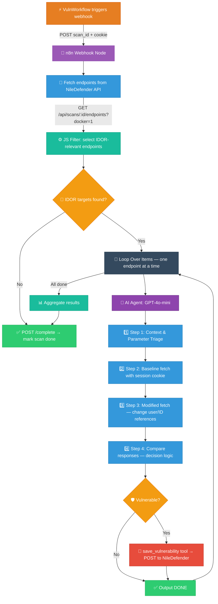

---

## 15. AI Report Generation Flow

```mermaid
flowchart LR
    A["🖱️ User clicks Generate Report"] --> B["📡 POST /api/scans/:id/report"]
    B --> C["💾 Read vulns from DB"]
    C --> D["🤖 Send to Groq LLM"]
    D --> E["📝 AI generates styled HTML report"]
    E --> F["📄 WeasyPrint: HTML → PDF bytes"]
    F --> G["📥 Stream PDF to browser download"]

    classDef user fill:#e74c3c,stroke:#c0392b,color:#fff
    classDef api fill:#3498db,stroke:#2980b9,color:#fff
    classDef data fill:#2ecc71,stroke:#27ae60,color:#fff
    classDef ai fill:#9b59b6,stroke:#8e44ad,color:#fff
    classDef generate fill:#e67e22,stroke:#d35400,color:#fff
    classDef pdf fill:#f39c12,stroke:#e67e22,color:#fff
    classDef download fill:#1abc9c,stroke:#16a085,color:#fff

    class A user
    class B api
    class C data
    class D ai
    class E generate
    class F pdf
    class G download
```

---

## 17. Scan Status Lifecycle

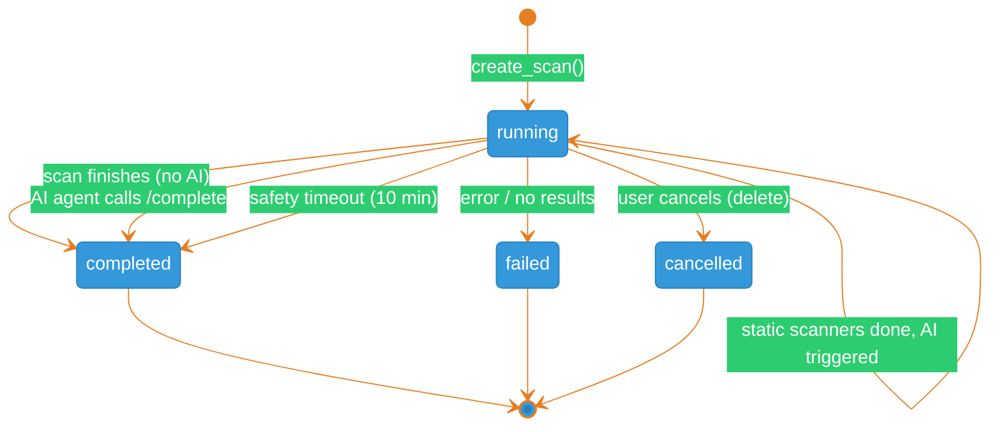
