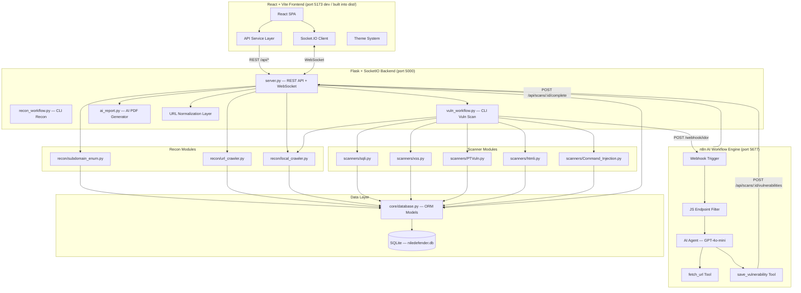
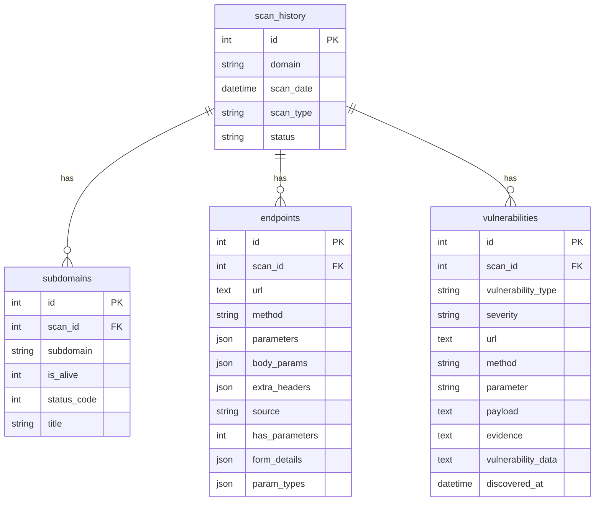
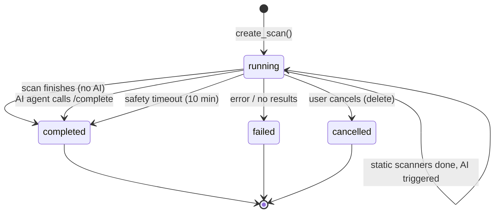
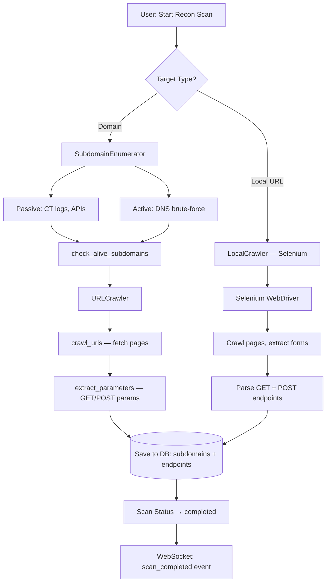
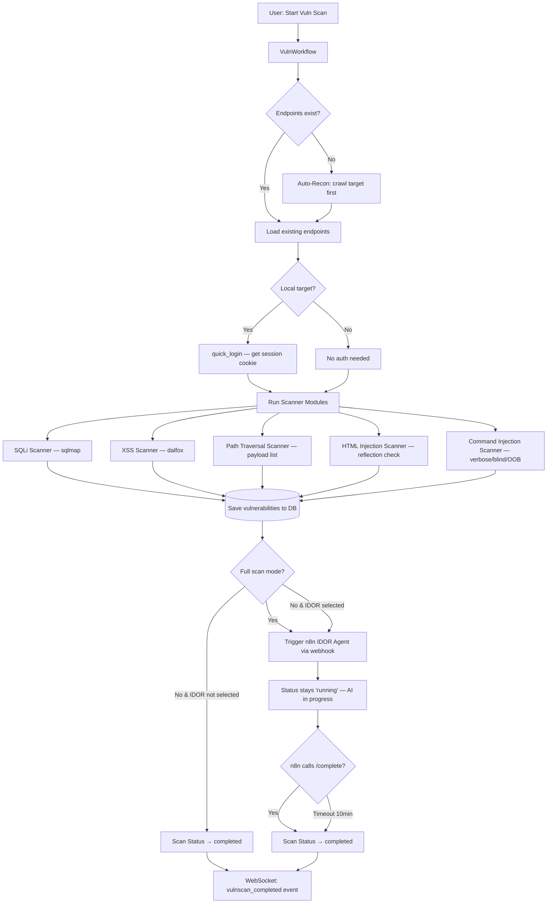
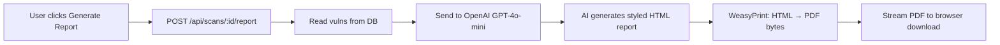
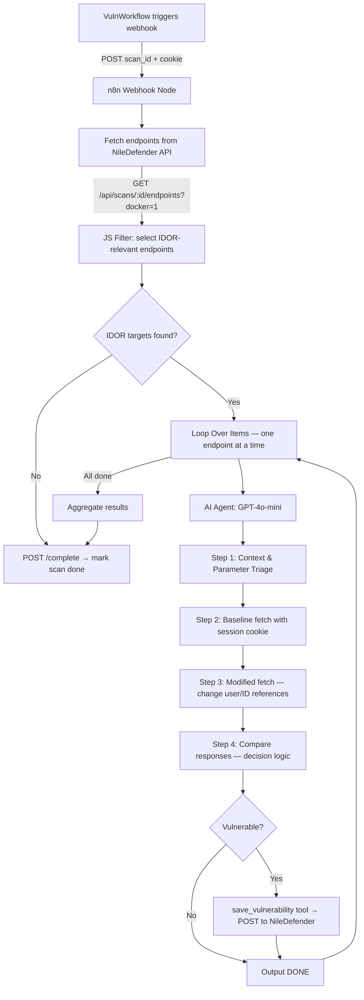

# NileDefender — Project Knowledge Base

> **Purpose:** This file gives any developer or AI assistant a complete understanding of
> the NileDefender project — its idea, architecture, file structure, data flow, and
> current state — in one place.

---

## 🎯 Project Idea

**NileDefender** is a **web vulnerability scanner** built for security researchers and
penetration testers. It automates the full pipeline from **reconnaissance** (discovering
subdomains & endpoints) to **vulnerability scanning** (SQLi, XSS, Path Traversal, HTML
Injection, Command Injection, IDOR) and **AI-powered report generation** (PDF reports via OpenAI GPT-4o-mini).

The project also integrates **n8n** as an AI workflow engine to autonomously test for
**IDOR (Insecure Direct Object Reference)** vulnerabilities using an LLM-based AI Agent.

### Key Features

| Feature | Description |
|---|---|
| **Subdomain Enumeration** | Passive (CT logs, APIs) + Active (DNS brute-force) |
| **URL Crawling** | Discover endpoints and extract GET/POST parameters |
| **Local App Crawling** | Selenium-based crawler for localhost apps (e.g. bWAPP, DVWA) |
| **SQL Injection Scanner** | Uses sqlmap under the hood |
| **XSS Scanner** | Uses dalfox (Go-based XSS scanner) for reflected/stored XSS detection |
| **Path Traversal Scanner** | Custom payload-based LFI/directory traversal detection |
| **HTML Injection Scanner** | Payload reflection analysis |
| **Command Injection Scanner** | Verbose, time-based, and OOB (Out-of-Band) injection detection |
| **IDOR Scanner (AI Agent)** | n8n + GPT-4o-mini AI Agent for automated IDOR testing |
| **Real-time Updates** | WebSocket (Socket.IO) for live scan progress |
| **AI Report Generation** | Groq LLM generates professional PDF security assessment |
| **Data Export** | JSON/CSV export of all scan data |
| **React Dashboard** | Modern React + Vite SPA with multi-theme support |
| **Docker Deployment** | Multi-stage Docker build + Docker Compose orchestration |
| **Docker URL Normalization** | Automatic `host.docker.internal` ↔ `localhost` translation |

---

## 🏗️ Architecture Overview



### Architecture Pattern

```
Production:  Flask serves React build from frontend/dist/
Development: Vite dev server (port 5173) proxies /api/* and /socket.io/* to Flask (port 5000)
Docker:      Multi-stage build → Node.js builds React → Python runtime serves everything
             n8n runs as a separate container on port 5677 (internal 5678)
```

### Docker Networking

```
┌─────────────────────────────────────────────────────────────┐
│  Docker Network: niledefender-net                           │
│                                                             │
│  ┌──────────────────┐    ┌───────────────┐                  │
│  │  niledefender     │    │  n8n          │                  │
│  │  :5000            │◄───│  :5678 (→5677)│                  │
│  │                   │    │               │                  │
│  │  host.docker.     │    │  host.docker. │                  │
│  │  internal:host-gw │    │  internal     │                  │
│  └──────────────────┘    └───────────────┘                  │
│                                                             │
│  URL Normalization:                                         │
│    In-container:  localhost → host.docker.internal           │
│    For UI/DB:     host.docker.internal → localhost           │
│    For n8n:       ?docker=1 query param → host.docker.int.  │
└─────────────────────────────────────────────────────────────┘
```

---

## 📁 File Structure

```
NileDefender/
├── server.py                  # 🔹 Main entry point — Flask API + WebSocket + serves React
├── recon_workflow.py          # 🔹 CLI for standalone reconnaissance
├── vuln_workflow.py           # 🔹 CLI for standalone vulnerability scanning
├── ai_report.py               # 🔹 AI report generator (OpenAI GPT-4o-mini → HTML → PDF via WeasyPrint)
├── config.ini                 # 🔑 API keys (OpenAI, SecurityTrails, n8n webhook URL)
├── requirements.txt           # 📦 Python dependencies (Python 3.13)
├── agent_idor.json            # 🤖 n8n AI IDOR workflow (import into n8n)
├── Dockerfile                 # 🐳 Multi-stage Docker build (Node.js + Python)
├── docker-compose.yml         # 🐳 Docker Compose (niledefender + n8n services)
├── .dockerignore              # Docker build exclusions
│
├── core/                      # 📂 Core infrastructure
│   ├── __init__.py
│   └── database.py            # 🔹 SQLAlchemy ORM models + CRUD functions
│
├── recon/                     # 📂 Reconnaissance modules
│   ├── __init__.py
│   ├── subdomain_enum.py      # 🔹 Subdomain discovery (passive + active)
│   ├── url_crawler.py         # 🔹 URL crawling + parameter extraction
│   └── local_crawler.py       # 🔹 Selenium-based local app crawler + auto-login
│
├── scanners/                  # 📂 Vulnerability scanner modules
│   ├── __init__.py            # 🔹 Scanner registry (SCANNER_MODULES dict)
│   ├── base.py                # 🔹 Base scanner class
│   ├── sqli.py                # 🔹 SQL Injection scanner (wraps sqlmap)
│   ├── xss.py                 # 🔹 XSS scanner (wraps dalfox)
│   ├── PTVuln.py              # 🔹 Path Traversal / LFI scanner
│   ├── htmli.py               # 🔹 HTML Injection scanner
│   ├── Command_Injection.py   # 🔹 OS Command Injection scanner (verbose, time-based, OOB)
│   └── payloads/
│       └── directory_traversal.txt  # Payload wordlist for path traversal
│
├── frontend/                  # 📂 React + Vite SPA
│   ├── package.json           # Dependencies: react, react-router-dom, socket.io-client
│   ├── vite.config.js         # Dev proxy → Flask :5000
│   ├── index.html             # Entry HTML with SEO meta tags
│   ├── src/
│   │   ├── main.jsx           # React entry point
│   │   ├── App.jsx            # App shell — BrowserRouter + layout + routes
│   │   ├── index.css          # 🎨 Global design system (multi-theme support)
│   │   ├── hooks/
│   │   │   ├── useSocket.js   # Custom Socket.IO hook for real-time scan updates
│   │   │   └── useTheme.jsx   # Theme context provider + theme definitions
│   │   ├── services/
│   │   │   └── api.js         # All REST API calls + export/download helpers
│   │   ├── components/
│   │   │   ├── Sidebar.jsx        # Navigation sidebar with connection status
│   │   │   ├── StatCard.jsx       # Dashboard/detail stat cards
│   │   │   ├── Badge.jsx          # Status, severity, and method badges
│   │   │   ├── NewScanModal.jsx   # Recon scan + Vuln scan creation modal
│   │   │   ├── DeleteModal.jsx    # Single/bulk delete confirmation modal
│   │   │   ├── Notification.jsx   # Toast notification system (context-based)
│   │   │   └── ThemeSwitcher.jsx  # 🎨 Theme picker dropdown component
│   │   └── pages/
│   │       ├── Dashboard.jsx     # Overview: stats + recent scans
│   │       ├── Scans.jsx         # Scan list (cards grid)
│   │       ├── ScanDetails.jsx   # Single scan: stats, tabs, export, AI report
│   │       ├── Subdomains.jsx    # Aggregated subdomains across all scans
│   │       ├── Endpoints.jsx     # Aggregated endpoints with method filters
│   │       └── Vulnerabilities.jsx  # Aggregated vulns with severity filters
│   └── dist/                  # Built production bundle (served by Flask)
│
├── output/                    # 📂 Runtime data
│   └── niledefender.db        # SQLite database (auto-created)
│
├── templates/                 # 📂 Fallback template (if React build doesn't exist)
└── Documents/                 # 📂 Project documentation files
```

---

## 💾 Database Schema



### Scan Status Lifecycle



### Vulnerability Types Discovered

| Vulnerability Type | Scanner | Severity | Detection Method |
|---|---|---|---|
| SQL Injection | `sqli.py` (sqlmap) | High | Automated sqlmap analysis |
| Cross-Site Scripting (XSS) | `xss.py` (dalfox) | High | dalfox reflected/stored XSS |
| Path Traversal | `PTVuln.py` | High | Payload wordlist + response analysis |
| HTML Injection | `htmli.py` | High | Payload reflection analysis |
| Command Injection (Verbose) | `Command_Injection.py` | High | Output-based detection (id, whoami) |
| Command Injection (Blind) | `Command_Injection.py` | High | Time-based detection (sleep, ping) |
| IDOR | n8n AI Agent | High | AI-powered baseline vs modified request comparison |

---

## 🔄 Data Flow — Scan Pipeline

### Recon Scan Flow



### Vulnerability Scan Flow



### AI Report Flow



### n8n IDOR Agent Flow



---

## 🌐 REST API Reference

| Method | Endpoint | Description |
|--------|----------|-------------|
| `GET` | `/api/dashboard/stats` | Aggregated stats across all scans |
| `GET` | `/api/scans` | List all scans |
| `POST` | `/api/scans` | Create new recon scan (auto-detects local vs remote) |
| `GET` | `/api/scans/:id` | Get full scan details (scan + subdomains + endpoints + vulns) |
| `DELETE` | `/api/scans/:id` | Delete scan + all related data |
| `DELETE` | `/api/scans/all` | Delete all scans |
| `GET` | `/api/scans/search?target=` | Search for existing scans by target |
| `GET` | `/api/scans/:id/stats` | Get scan statistics |
| `GET` | `/api/scans/:id/subdomains` | List subdomains for a scan |
| `GET` | `/api/scans/:id/endpoints` | List endpoints (supports `?docker=1` for Docker-translated URLs) |
| `GET` | `/api/scans/:id/vulnerabilities` | List vulnerabilities for a scan |
| `POST` | `/api/scans/:id/vulnerabilities` | Add external vulnerability (used by n8n AI Agent) |
| `POST` | `/api/scans/:id/vulnscan` | Start vuln scan on an existing scan |
| `POST` | `/api/vulnscan/start` | Start vuln scan on a new target |
| `POST` | `/api/scans/:id/complete` | Mark scan as completed (called by n8n after AI analysis) |
| `POST` | `/api/scans/:id/report` | Generate AI PDF report → download |
| `GET` | `/api/all/subdomains` | Aggregated subdomains across all scans |
| `GET` | `/api/all/endpoints` | Aggregated endpoints across all scans |
| `GET` | `/api/all/vulnerabilities` | Aggregated vulnerabilities across all scans |

### WebSocket Events

| Event | Direction | Description |
|-------|-----------|-------------|
| `connect` | Server → Client | Connection established |
| `join_scan` | Client → Server | Join a scan room for real-time updates |
| `scan_update` | Server → Client | Progress update (phase, message) — URLs normalized to localhost |
| `scan_completed` | Server → Client | Recon scan finished |
| `vulnscan_completed` | Server → Client | Vulnerability scan finished (or AI still running) |
| `scan_error` | Server → Client | Scan failed with error |

---

## 🎨 Design System

### Multi-Theme Support

The frontend supports multiple themes via the `useTheme` hook and `ThemeSwitcher` component.
Users can switch themes at any time; the preference is persisted in `localStorage`.

### Color Palette — Default Theme (Dark Navy + Teal)

| Role | Value | Preview |
|------|-------|---------| 
| **Background (deep)** | `#060e1a` | 🟫 Near-black navy |
| **Background (cards)** | `rgba(12, 26, 46, 0.72)` | 🟫 Translucent navy |
| **Accent Primary** | `#6cc5c7` | 🟩 Teal/Cyan |
| **Accent Secondary** | `#4fa8ab` | 🟩 Darker teal |
| **Accent Bright** | `#8ee0e2` | 🟩 Light teal |
| **Text Primary** | `#eaf5f6` | ⬜ Cool white |
| **Text Secondary** | `#8db4bc` | 🔵 Muted teal |
| **Text Muted** | `#4a7580` | 🔵 Dark teal |
| **Borders** | `rgba(108, 197, 199, 0.1)` | 🔲 Subtle teal |

### Design Principles

- **Glassmorphism**: Translucent cards with backdrop-filter blur
- **Depth**: Multi-layer shadows + glow effects on hover
- **Micro-animations**: Hover lifts, glow pulses, smooth transitions
- **Typography**: Inter font, weights 400–900, tight letter-spacing for headings
- **Dark theme by default**: Designed for low-light security operations
- **Theme switcher**: Users can swap entire color palette via dropdown

---

## 🧩 Scanner Module Registry

Scanners are registered in `scanners/__init__.py` via the `SCANNER_MODULES` dict.

```python
SCANNER_MODULES = {
    'sqli':  { 'name': 'SQL Injection',               'run': run_sqli_scan  },
    'pt':    { 'name': 'Path Traversal',              'run': run_pt_scan    },
    'htmli': { 'name': 'HTML Injection',              'run': run_htmli_scan },
    'xss':   { 'name': 'Cross-Site Scripting (XSS)',  'run': run_xss_scan   },
    'cmdi':  { 'name': 'Command Injection',           'run': run_cmdi_scan  },
}
```

> **Note:** IDOR scanning is handled externally by the n8n AI Agent workflow, not by a
> Python scanner module. It is triggered via webhook after static scanners complete.

### Adding a New Scanner

1. Create `scanners/new_scanner.py` with a function:
   ```python
   def run_new_scan(scan_id, db_path, on_progress=None, cookie=None, cancel_check=None) -> dict:
       # ... scan logic ...
       return {'targets_scanned': N, 'vulnerabilities_found': M}
   ```
2. Register in `scanners/__init__.py`:
   ```python
   from scanners.new_scanner import run_new_scan
   SCANNER_MODULES['new'] = {
       'name': 'New Scanner',
       'description': '...',
       'run': run_new_scan,
   }
   ```
3. Add checkbox in `frontend/src/components/NewScanModal.jsx` module grid
4. Each scanner must support `cancel_check` callback for scan cancellation
5. Each scanner should use `_docker_translate_url()` for outgoing requests and
   `_docker_reverse_url()` when storing URLs in the database

---

## 🐳 Docker Configuration

### Multi-Stage Dockerfile

| Stage | Image | Purpose |
|-------|-------|---------|
| **Stage 1** | `node:20-slim` | Build React frontend → `dist/` |
| **Stage 2** | `python:3.13-slim` | Python runtime with system deps |

### System Dependencies Installed

| Package | Purpose |
|---------|---------|
| `firefox-esr` | Selenium browser for local crawling |
| `geckodriver` (v0.35.0) | Firefox WebDriver for Selenium |
| `sqlmap` | SQL injection detection engine |
| `dalfox` (v2.13.0) | Go-based XSS scanner |
| `libpango`, `libcairo`, etc. | WeasyPrint PDF rendering |
| `curl`, `wget` | Binary downloads |

### Docker Compose Services

| Service | Image | Port | Purpose |
|---------|-------|------|---------|
| `niledefender` | Custom (Dockerfile) | 5000 | Main app — Flask + React |
| `n8n` | `n8nio/n8n` | 5677→5678 | AI workflow engine for IDOR scanning |

### Key Environment Variables

| Variable | Service | Value | Purpose |
|----------|---------|-------|---------|
| `RUNNING_IN_DOCKER` | niledefender | `1` | Enables Docker URL translation |
| `PYTHONUNBUFFERED` | niledefender | `1` | Real-time log output |
| `N8N_DIAGNOSTICS_ENABLED` | n8n | `false` | Prevents UI timeout from diagnostic fetches |
| `N8N_PERSONALIZATION_ENABLED` | n8n | `false` | Prevents community node fetch delays |
| `WEBHOOK_URL` | n8n | `http://localhost:5677/` | External webhook URL |
| `EXECUTIONS_TIMEOUT` | n8n | `600` | 10-min workflow timeout |
| `EXECUTIONS_TIMEOUT_MAX` | n8n | `1200` | 20-min max workflow timeout |

---

## 🔗 Docker URL Normalization

The project implements consistent URL normalization to handle Docker's internal networking:

### The Problem
When running inside Docker, `localhost` refers to the container itself — not the host machine.
Scanners need to reach services on the host (e.g., bWAPP at `localhost:80`), so URLs must be
translated to `host.docker.internal`.

### The Solution

| Location | Direction | Implementation |
|----------|-----------|----------------|
| `server.py` | Outgoing (to scanners) | `_docker_translate_url()` — `localhost → host.docker.internal` |
| `server.py` | Incoming (to DB/UI) | `_docker_reverse_url()` — `host.docker.internal → localhost` |
| `server.py` | API responses | All `/api/` responses normalize URLs to localhost |
| `server.py` | WebSocket messages | `emit_progress()` normalizes URLs before sending |
| `server.py` | `/api/scans/:id/endpoints` | Supports `?docker=1` query param for n8n callers |
| `vuln_workflow.py` | Outgoing/Incoming | Same `_docker_translate_url()` / `_docker_reverse_url()` |
| `scanners/xss.py` | Outgoing/DB writes | Translates for requests, reverses for DB storage |
| `scanners/Command_Injection.py` | Outgoing/DB writes | Same pattern |
| `server.py` | n8n vulnerability POST | `_docker_reverse_url()` normalizes before DB save |

---

## 🖥️ Running the Project

### Docker Mode (Recommended)

```bash
docker compose up -d --build    # Build & start everything
# Wait 2-3 minutes, then open:
# Dashboard → http://localhost:5000
# n8n       → http://localhost:5677
```

See [N8N_SETUP_GUIDE.md](N8N_SETUP_GUIDE.md) for first-time n8n setup instructions.

### Development Mode (Hot Reload)

```bash
# Terminal 1: Flask backend
cd NileDefender
source my-env/bin/activate
python server.py                    # → http://localhost:5000

# Terminal 2: Vite dev server (with HMR)
cd NileDefender/frontend
npm run dev                         # → http://localhost:5173 (proxies to Flask)
```

### Production Mode

```bash
cd NileDefender/frontend
npm run build                       # Build React → frontend/dist/
cd ..
python server.py                    # Flask serves React from dist/ at :5000
```

### CLI Tools (No Web UI)

```bash
# Recon only
python recon_workflow.py -d example.com

# Vulnerability scan (all modules)
python vuln_workflow.py --target http://localhost/bWAPP/

# Vulnerability scan (specific modules)
python vuln_workflow.py --target http://localhost/bWAPP/ --modules sqli xss pt

# List available modules
python vuln_workflow.py --list-modules

# AI report
python ai_report.py --db output/niledefender.db --pdf report.pdf
```

---

## ⚙️ Key Dependencies

| Category | Package | Purpose |
|----------|---------|---------| 
| **Web** | Flask, Flask-SocketIO, Flask-CORS | REST API + WebSocket |
| **Async** | gevent | Async/green threads for SocketIO |
| **Database** | SQLAlchemy | ORM + SQLite |
| **HTTP** | Requests, urllib3 | HTTP requests |
| **DNS** | dnspython | DNS resolution |
| **Parsing** | BeautifulSoup4, lxml | HTML parsing |
| **Browser** | Selenium, webdriver-manager | Local app crawling |
| **AI (Report)** | OpenAI (GPT-4o-mini) | LLM API for report generation |
| **AI (IDOR)** | n8n + OpenAI (GPT-4o-mini) | External AI agent for IDOR scanning |
| **PDF** | WeasyPrint | HTML → PDF conversion |
| **Vuln Scanner** | sqlmap (system) | SQL injection detection |
| **Vuln Scanner** | dalfox (system, Go binary) | XSS detection |
| **Frontend** | React 19, React Router 7, Socket.IO Client | SPA + routing + WebSocket |
| **Build** | Vite 8 | Frontend build tool |

