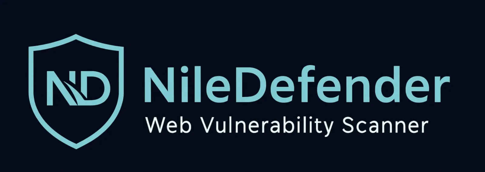
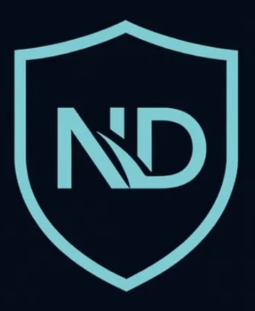

<p align="center">
  
</p>

<p align="center">
  
  
  
  
  
  
</p>

<p align="center">
  <b>🛡️ Automated Reconnaissance & Vulnerability Scanning with AI-Powered Analysis</b>
</p>

<p align="center">
  <a href="#-quick-start">Quick Start</a> •
  <a href="#-features">Features</a> •
  <a href="#-architecture">Architecture</a> •
  <a href="#-ai-idor-agent">AI Agent</a> •
  <a href="Screenshots/">Screenshots</a> •
  <a href="Documents/N8N_SETUP_GUIDE.md">n8n Setup Guide</a>
</p>

---

## 📖 About

**NileDefender** is an advanced AI-powered web application penetration testing framework designed to automate the entire penetration testing pipeline — from reconnaissance to exploitation to reporting. It combines **traditional scanning techniques** with an **AI-powered IDOR agent** that autonomously discovers access control vulnerabilities.

```
🔍 Subdomain Discovery → 🕷️ Endpoint Crawling → 💉 Vulnerability Scanning → 🤖 AI IDOR Analysis → 📄 PDF Report
```

Built for security researchers and penetration testers, NileDefender works on both **remote domains** (`example.com`) and **local targets** (`http://localhost/bWAPP/`), with a modern React dashboard that shows every result in real-time via WebSocket.

---

## ✨ Features

### 🔍 Reconnaissance
| Module | Description |
|--------|-------------|
| **Subdomain Enumeration** | Passive (CT logs, SecurityTrails, crt.sh, VirusTotal) + Active (DNS brute-force) |
| **URL Crawling** | Multi-threaded endpoint discovery with GET/POST parameter extraction |
| **Local App Crawling** | Selenium + Firefox headless crawler with auto-login for localhost apps |

### 💉 Vulnerability Scanners
| Scanner | Engine | Detection Method |
|---------|--------|-----------------|
| **SQL Injection** | sqlmap | Automated SQLi analysis (blind, error-based, union) |
| **Cross-Site Scripting (XSS)** | dalfox | Reflected & stored XSS via Go-based scanner |
| **Path Traversal / LFI** | Custom | Payload wordlist + response fingerprinting |
| **HTML Injection** | Custom | Payload reflection analysis in response body |
| **Command Injection** | Custom | Verbose output, time-based blind, and OOB detection |
| **IDOR** | n8n + GPT-4o-mini | AI agent compares baseline vs modified requests |

### 🧠 AI-Powered Features
| Feature | Description |
|---------|-------------|
| **AI IDOR Agent** | Autonomous n8n workflow using GPT-4o-mini to test endpoints for Insecure Direct Object References |
| **AI Report Generator** | GPT-4o-mini generates professional PDF security assessment reports with executive summary, CVSS scores, and remediation strategies |

### 🖥️ Dashboard & UX
| Feature | Description |
|---------|-------------|
| **Real-time Updates** | WebSocket (Socket.IO) pushes live scan progress to the browser |
| **Multi-Theme Support** | Switch between multiple color themes with live preview |
| **Data Export** | Export scan results as JSON or CSV |
| **Scan Reuse** | Reuse previously crawled endpoints for faster vulnerability scans |
| **Bulk Operations** | Delete individual scans or clear all data at once |

---

## 🚀 Quick Start

### Option 1: Docker (Recommended)

```bash
git clone https://github.com/AbdelhamedRagheb/NileDefender.git
cd NileDefender
```

Add your OpenAI API key to `config.ini`:
```ini
[API_KEYS]
openai = sk-your-api-key-here
```

Start the application:
```bash
docker compose up -d --build
```

| Service | URL |
|---------|-----|
| **Dashboard** | http://localhost:5000 |
| **n8n** | http://localhost:5677 |

> 📖 **First-time n8n setup required** — see [N8N_SETUP_GUIDE.md](Documents/N8N_SETUP_GUIDE.md) to import the IDOR workflow and add your OpenAI credential.

### Option 2: Manual Installation

```bash
git clone https://github.com/AbdelhamedRagheb/NileDefender.git
cd NileDefender

# Backend
python3.13 -m venv my-env
source my-env/bin/activate
pip install -r requirements.txt

# Frontend
cd frontend && npm install && npm run build && cd ..

# Run
python server.py
```

> ⚠️ Manual setup requires **sqlmap**, **dalfox**, **Firefox ESR**, and **geckodriver** installed on your system. Docker handles all of this automatically.

---

## 🏗️ Architecture

```
┌──────────────────────────────────────────────────────────────────────────┐
│                        NileDefender Architecture                        │
├──────────────────────────────────────────────────────────────────────────┤
│                                                                          │
│   React 19 + Vite 8                    Flask + Socket.IO                │
│  ┌─────────────────┐                 ┌─────────────────────┐            │
│  │   Dashboard UI   │ ──── REST ────▶│   server.py          │            │
│  │   (port 5173)    │◀── WebSocket ──│   (port 5000)        │            │
│  └─────────────────┘                 └──────┬──────────────┘            │
│                                              │                           │
│                              ┌───────────────┼───────────────┐          │
│                              ▼               ▼               ▼          │
│                     ┌──────────────┐ ┌─────────────┐ ┌──────────────┐   │
│                     │ Recon Modules│ │  Scanner     │ │  AI Report   │   │
│                     │              │ │  Modules     │ │  Generator   │   │
│                     │ • Subdomains │ │ • SQLi       │ │ • GPT-4o-mini│   │
│                     │ • URL Crawl  │ │ • XSS        │ │ • WeasyPrint │   │
│                     │ • Selenium   │ │ • LFI        │ │ • PDF Output │   │
│                     └──────────────┘ │ • HTMLi      │ └──────────────┘   │
│                                      │ • CMDi       │                    │
│                                      └──────┬──────┘                    │
│                                             │ webhook                    │
│                                             ▼                            │
│                                    ┌─────────────────┐                  │
│                                    │   n8n AI Agent   │                  │
│                                    │   (port 5677)    │                  │
│                                    │                  │                  │
│                                    │  GPT-4o-mini     │                  │
│                                    │  IDOR Detection  │                  │
│                                    └─────────────────┘                  │
│                                                                          │
│                          ┌──────────────┐                               │
│                          │   SQLite DB   │                               │
│                          │niledefender.db│                               │
│                          └──────────────┘                               │
└──────────────────────────────────────────────────────────────────────────┘
```

### Tech Stack

| Layer | Technology |
|-------|-----------|
| **Frontend** | React 19, Vite 8, Socket.IO Client, React Router 7 |
| **Backend** | Flask, Flask-SocketIO, Flask-CORS, gevent |
| **Database** | SQLAlchemy + SQLite |
| **Scanners** | sqlmap, dalfox, custom Python modules |
| **Browser Automation** | Selenium + Firefox ESR + geckodriver |
| **AI** | OpenAI GPT-4o-mini (reports + IDOR agent) |
| **Workflow Engine** | n8n (Dockerized, AI agent orchestration) |
| **PDF Generation** | WeasyPrint (HTML → PDF) |
| **Containerization** | Docker multi-stage build + Docker Compose |

---

## 🤖 AI IDOR Agent

The IDOR Agent is an autonomous AI workflow powered by **n8n + GPT-4o-mini** that actively tests endpoints for **Insecure Direct Object Reference** vulnerabilities after each Full Scan.

### How It Works

```
1. Full Scan completes static scanners (SQLi, XSS, LFI, HTMLi, CMDi)
2. NileDefender triggers n8n webhook with scan_id + session cookie
3. n8n fetches endpoints and filters for IDOR-relevant targets
4. AI Agent analyzes each endpoint:
   a. Makes a baseline request with original parameters
   b. Modifies user/entity references (id, email, account, etc.)
   c. Compares responses to detect unauthorized data access
5. Confirmed IDOR findings are saved back to NileDefender
6. Scan status updates to "Completed" automatically
```

### Setup

1. Open **n8n** at http://localhost:5677
2. Create an account (first time only)
3. Import `agent_idor.json` workflow
4. Add your **OpenAI API credential**
5. **Activate** the workflow

> 📖 Full step-by-step instructions: [N8N_SETUP_GUIDE.md](Documents/N8N_SETUP_GUIDE.md)

---

## 🔧 Usage

### From the Dashboard

1. Open http://localhost:5000
2. Click **New Scan**
3. Choose **Recon Scan** (discover assets) or **Vulnerability Scan** (find vulns)
4. Enter your target and configure options
5. Watch results appear in real-time

### From the CLI

```bash
# Reconnaissance
python recon_workflow.py -d example.com

# Vulnerability scan (all modules)
python vuln_workflow.py --target http://localhost/bWAPP/

# Vulnerability scan (specific modules)
python vuln_workflow.py --target http://localhost/bWAPP/ --modules sqli xss pt

# List available scanner modules
python vuln_workflow.py --list-modules

# Generate AI PDF report
python ai_report.py --db output/niledefender.db --pdf report.pdf
```

---

## 🧪 Tested On

NileDefender has been tested against the following intentionally vulnerable applications:

| Target | Type | Description |
|--------|------|-------------|
| [**bWAPP**](http://www.yoursite.com/bWAPP/) | Local (Docker/VM) | Buggy Web Application — 100+ vulnerability scenarios |
| [**DVWA**](https://github.com/digininja/DVWA) | Local (Docker/VM) | Damn Vulnerable Web Application — multiple security levels |
| **Remote Domains** | Remote | Any public domain for subdomain enumeration & endpoint discovery |

> ⚠️ **Important Note for Local Targets:** If you are running NileDefender via Docker and want to scan a local application on your machine (like DVWA), **your target application must be bound to `0.0.0.0`** (all interfaces) rather than `127.0.0.1`. Docker's network isolation specifically prevents containers from reaching your host's strict loopback address. For example, use `-p 4280:80` instead of `-p 127.0.0.1:4280:80` in your target's Docker Compose file.

---

## 📁 Project Structure

```
NileDefender/
├── server.py                  # Flask API + WebSocket + serves React
├── vuln_workflow.py           # Vulnerability scanning workflow (CLI + API)
├── recon_workflow.py          # Reconnaissance workflow (CLI)
├── ai_report.py               # AI report generator (GPT-4o-mini → PDF)
├── agent_idor.json            # n8n IDOR workflow (import into n8n)
├── config.ini                 # API keys (OpenAI, etc.)
├── Dockerfile                 # Multi-stage Docker build
├── docker-compose.yml         # Docker Compose (app + n8n)
│
├── core/                      # Database ORM models + CRUD
├── recon/                     # Recon modules (subdomains, crawlers)
├── scanners/                  # Vulnerability scanner modules
│   ├── sqli.py                #   SQL Injection (sqlmap)
│   ├── xss.py                 #   XSS (dalfox)
│   ├── PTVuln.py              #   Path Traversal
│   ├── htmli.py               #   HTML Injection
│   └── Command_Injection.py   #   Command Injection
│
└── frontend/                  # React + Vite SPA
    └── src/
        ├── components/        #   UI components (Sidebar, Modals, Theme, etc.)
        ├── pages/             #   Dashboard, Scans, ScanDetails, etc.
        ├── hooks/             #   useSocket, useTheme
        └── services/          #   API service layer
```

---


## 📄 Documentation

| Document | Description |
|----------|-------------|
| [**N8N_SETUP_GUIDE.md**](Documents/N8N_SETUP_GUIDE.md) | Step-by-step n8n setup, workflow import, and troubleshooting |
| [**PROJECT_KNOWLEDGE.md**](Documents/PROJECT_KNOWLEDGE.md) | Complete technical reference — architecture, API, database schema, data flows |
| [**ARCHITECTURE_DIAGRAMS.md**](Documents/ARCHITECTURE_DIAGRAMS.md) | Full architectural, flowchart, and sequence diagrams of the project |
| [**install.txt**](install.txt) | Manual installation dependencies and system requirements |

---

## ⚠️ Disclaimer

This tool is intended for **educational purposes** and **authorized security testing only**. Always obtain proper authorization before scanning any target. The developers are not responsible for any misuse or damage caused by this tool.

---

<p align="center">
  
  <br/>
  <b>NileDefender</b> — Built for defenders, by defenders.
</p>
